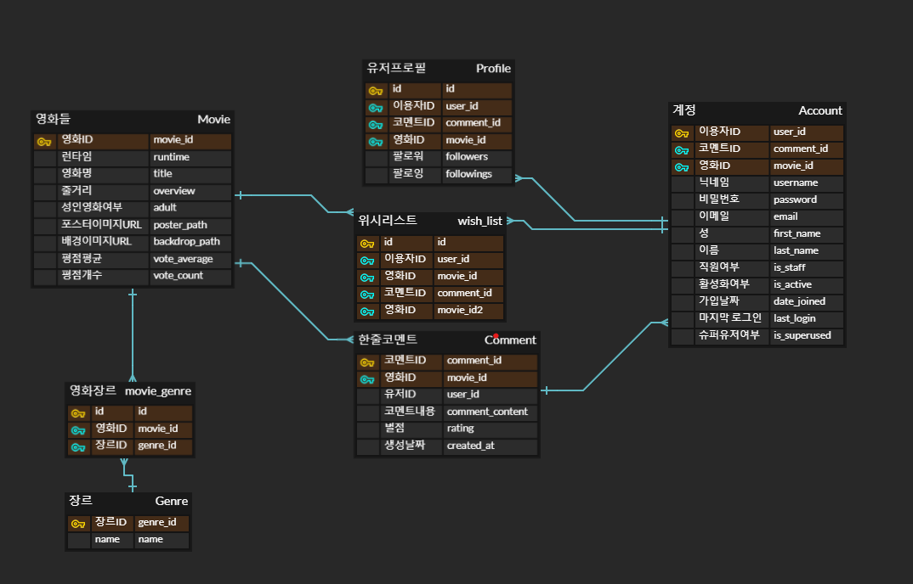

# CINEBUCKS
 영화 추천 사이트
## 프로젝트 소개

카페에서 커피를 주문하듯, 영화를 주문하는 'CINEBUCKS' 입니다.
## 1. 팀원 정보 및 업무 분담 내역
- 김현아 (Front-end) 
  - 활용기술 : FIGMA, VUE
- 이영아 (Back-end) 
  - 활용기술 : DJANGO
## 2. 목표 서비스 구현 및 실제 구현 정도
## - 실제 구현 서비스 
### A. MAIN
  1. 현재 박스 오피스 상위 영화 (순위 순서대로)
  2. 검색 기능
### B. MOVIE DETAIL & REVIEW
  1. 영화 세부목록
   - 세부정보 (제목, 줄거리, 평점, 배우목록)
   - 영화 예고편 
     - YOUTUBE API 활용
  2. 영화 주문하기 (좋아요, 위시리스트 담기)
   - 영화 주문, 영화 주문취소 기능 (좋아요, 좋아요 취소 기능)
   - 영화 주문 시 유저의 프로필에 주문목록(위시리스트)에 주문한 영화를 한꺼번에 볼 수 있음
  3. 영화 리뷰작성
   - 리뷰 작성 / 수정 / 삭제 기능
   - 별점으로 RATING기능

### C. ACCOUNT
1.  회원가입
   - username, password1, password2(확인용 패스워드) 입력시 회원가입
2.  로그인 / 로그아웃 기능
   - 로그인 시 리뷰 작성가능
### D. USER PROFILE
1. 팔로워, 팔로잉 기능
2. 영화주문목록(위시리스트) 

## - 미래 구현 희망 리스트 (구현 X) 
### A. COUPON
1. 내가 리뷰한 영화들 중에서 한 장르에 대한 영화가 5개 이상이면 해당 장르 쿠폰 발행
- EX) 로맨스에 해당하는 영화 5개 리뷰 시 -> 로맨티스트 쿠폰 발행
  - 시간이 없어 구현하지 못함
### B. 추가기능
1. 사용자 리뷰 반영된 평점
---
## 3. 데이터베이스 모델링(ERD)
### A. ERD 설계

### B. 데이터 수집
- TMDB API 이용
---
## 4. 영화 추천 알고리즘
1. 필터 기능
    - 장르, 러닝타임, 성인여부에 따라 중복해서 필터를 적용하면 조건에 해당되는 상위 20개의 영화를 추천해준다.
2. 검색 기능
    - 키워드를 입력하면 그 키워드가 들어간 모든 영화를 추천해준다.
    - 만약 검색결과가 없다면, 이미지와 함께 검색결과가 없음을 알린다.
3. 영화주문목록(위시리스트) 기능
    - 내가 원하는 사람의 프로필에 들어가면 그 사람의 영화주문목록(위시리스트)를 보고 영화 추천을 받을 수 있다.
- --
## 5. 서비스 대표 기능
1. 영화 주문 목록 기능
 - 영화 디테일 페이지에서 주문 버튼 클릭시 장바구니에 담기는 것처럼 위시리스트에 담긴다
 - 반대로 삭제를 누르면 뺄 수 있다
 - 사용자 프로필에서 위시리스트를 볼 수 있다
2. 영화 필터링 기능
 - 컨셉이 카페이기 때문에 커피 커스텀 메뉴를 만드는 것처럼 영화 필터링 기능을 추가했다
 - 장르, 런타임을 선택해서 영화 리스트를 필터링해서 받아올 수 있다
---
## 6. 프로젝트 후기
- 김현아
   -  django와 vue를 연동하는 부분에서 너무 많은 시간을 써서 css 부분이 조금 부족했던 것 같다
   - 회의를 통해 컨셉을 정하고, 기능을 정하고 이를 실제적으로 구현해나가는 과정이 힘들었지만 재미있었다
   - django 부분이 약했는데 영아가 담당한 db 받아오는 부분을 참고하면서 나도 지식이 늘어서 좋았다
   - css를 하면 할 수록 아쉬운 부분들이 계속 보였지만 일주일이라는 짧은 시간으로 많이 바꾸지 못한 것이 아쉬웠다
- 이영아
  - 프로젝트를 하면서 서비스를 기획하고, 데이터를 가져오고, 사이트를 개발하는 총 과정을 배우며 사이트를 개발하는 흐름에 대해서 알게 되었고, 초기에 핵심 기능을 무엇으로 할지, ERD과 컴포넌트 구성은 어떻게 짤지 기획하는 것이 중간에 헤매지 않고 원래 목적을 향해 갈 수 있는 방법인 것 같다.
  - 장고를 하며 며칠동안 같은 부분에서 헤매기도 하고, 배웠던 것들을 활용해가면서 기존에 왜 필요한지 몰랐던 옵션들의 필요성을 알게 되고, 헷갈렸던 부분에 대한 개념을 다시 바로 잡을 수 있었던 것 같다.
  - 프로젝트 기간동안 일이 겹쳐 바빴는데 현아가 많이 도와주어서 짧은 시간내에  결과물이 성공적으로 나올 수 있었던 것 같다. 함께한 현아에게 고마움을 표한다!
